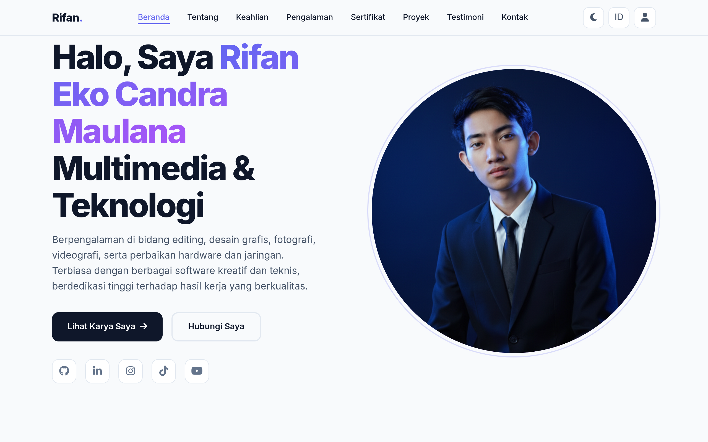
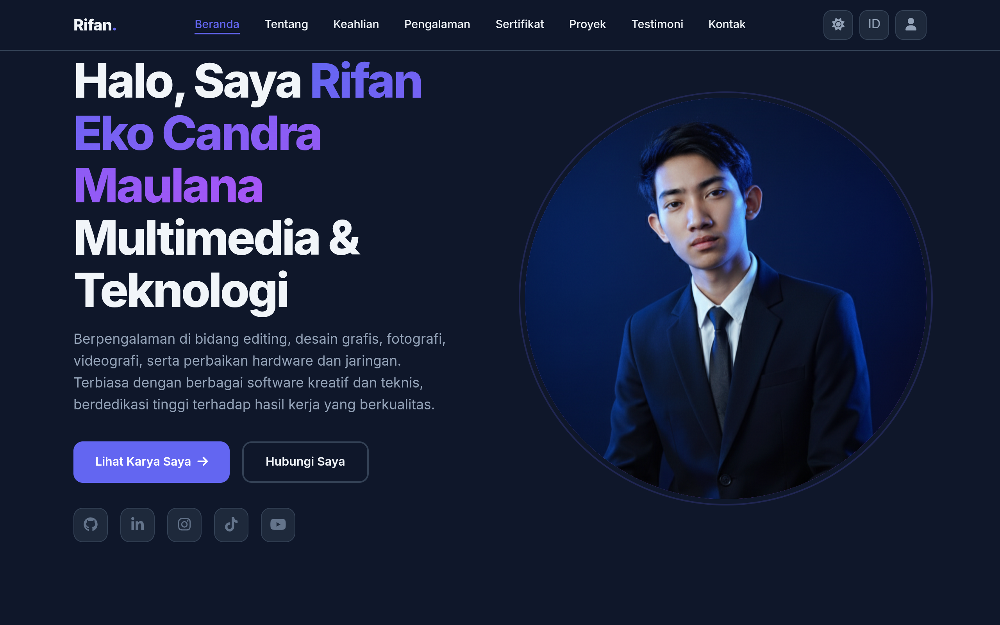

# Portofolio — Rifan Eko Candra Maulana

[](https://portofolio-korifcan.vercel.app)

An interactive portfolio website built with vanilla JavaScript and Firebase. Features real-time testimonials, ratings, comments, dark/light mode, bilingual support (ID/EN), and an integrated admin panel.

---

## Features

- **User Authentication** — Register, login, email verification, password reset, profile management with photo upload
- **Testimonials & Feedback** — Real-time CRUD with star ratings, likes, replies, filtering, and pagination
- **Comments** — Per-project discussion threads with replies and admin moderation
- **Ratings** — Live star ratings with auto-calculated averages
- **Dark/Light Mode** — Persisted preference with URL parameter override
- **Bilingual** — Full Indonesian and English translations
- **Admin Panel** — Inline panel (swipeable tabs) and dedicated page with dashboard, user/role management, content moderation
- **Contact Form** — Web3Forms integration with hCaptcha
- **Responsive** — Mobile-first design with hamburger navigation
- **Scroll Animations** — IntersectionObserver-based reveal effects
- **Image Slider** — Before/after comparison slider for project screenshots
- **Anti-DevTools** — Lightweight protection against casual inspection

---

## Tech Stack

| Technology | Purpose |
|------------|---------|
| HTML5 / CSS3 / Vanilla JS | Frontend (no framework) |
| Firebase Auth | Authentication |
| Cloud Firestore | Real-time database |
| Web3Forms | Contact form backend |
| Font Awesome 6.5 | Icons |
| Google Fonts (Inter) | Typography |
| Vercel / GitHub Pages | Hosting |

---

## Getting Started

```bash
git clone https://github.com/KoRifCan/Portofolio.git
cd Portofolio
python3 -m http.server 8000
# Open http://localhost:8000
```

No build tools required — it's a static site. To enable interactive features (login, comments, etc.), create a Firebase project and update the config.

---

## Project Structure

```
Portofolio/
├── index.html           # Main portfolio page
├── admin.html           # Admin dashboard
├── thank-you.html       # Post-contact redirect
├── robots.txt           # AI crawler blocklist
├── IMG_Profil.png       # Profile photo
├── screenshot-light.png # Project slider asset
└── screenshot-dark.png  # Project slider asset
```

---

## Deployment

### Vercel (recommended)

Push to GitHub → Import to [Vercel](https://vercel.com/new) → Framework: **Other** → Deploy.

### GitHub Pages

Repo Settings → Pages → Deploy from branch `main` → `/ (root)`.

---

## Screenshots

| Light Mode | Dark Mode |
|------------|-----------|
|  |  |

---

## License

© 2026 Rifan Eko Candra Maulana. All rights reserved.

---

## Contact

- **Email:** rifan.eko25@gmail.com
- **LinkedIn:** [rifan-eko-candra-maulana](https://linkedin.com/in/rifan-eko-candra-maulana)
- **GitHub:** [@KoRifCan](https://github.com/KoRifCan)
